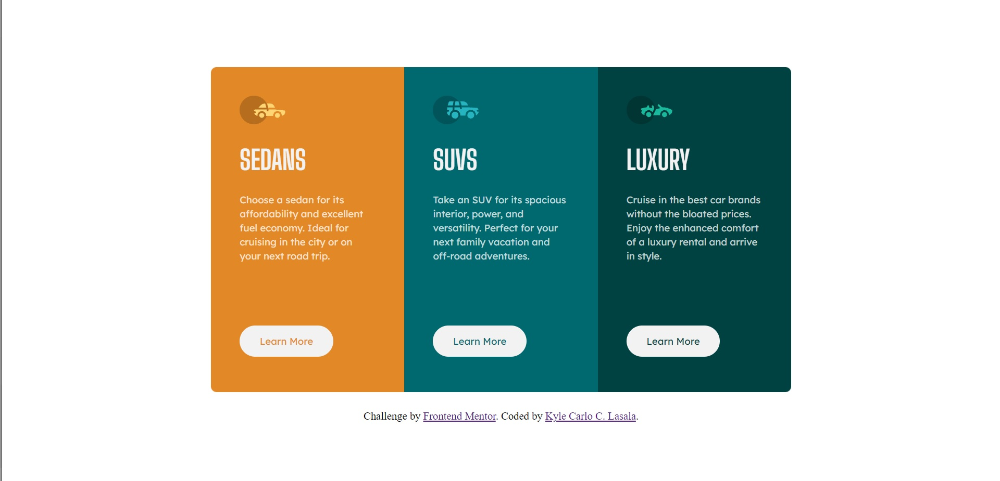

# Frontend Mentor - 3-column preview card component solution

This is a solution to the [3-column preview card component challenge on Frontend Mentor](https://www.frontendmentor.io/challenges/3column-preview-card-component-pH92eAR2-). Frontend Mentor challenges help you improve your coding skills by building realistic projects. 

## Table of contents

- [Overview](#overview)
  - [The challenge](#the-challenge)
  - [Screenshot](#screenshot)
  - [Links](#links)
- [My process](#my-process)
  - [Built with](#built-with)
  - [What I learned](#what-i-learned)
  - [Continued development](#continued-development)
  - [Useful resources](#useful-resources)
- [Author](#author)
- [Acknowledgments](#acknowledgments)

**Note: Delete this note and update the table of contents based on what sections you keep.**

## Overview

### The challenge

Users should be able to:

- View the optimal layout depending on their device's screen size
- See hover states for interactive elements

### Screenshot

### Links

- Solution URL: [https://github.com/KyleCarlo/3-column-preview-card-component-main](https://your-solution-url.com)
- Live Site URL: [https://kylecarlo.github.io/3-column-preview-card-component-main/](https://your-live-site-url.com)

## My process

### Built with

- HTML5
- CSS

**Note: These are just examples. Delete this note and replace the list above with your own choices**

### What I learned

I learned how to properly used flexbox and media queries in this challenge. I want to take more challenge to get familiar with other CSS properties.

**Note: Delete this note and the content within this section and replace with your own learnings.**

### Useful resources

- [https://www.w3schools.com/css/](https://www.example.com) - This website really helped me to remember some CSS properties. I learned the complexity of using the flexbox and media queries for responsive design of this challenge.

## Author

- Frontend Mentor - [@KyleCarlo](https://www.frontendmentor.io/profile/yourusername)

## Acknowledgments

I really appreciate the slack community for helping me in this project especially Grace Snow (U01D6CR3C68) for reviewing my code and suggesting better options.
